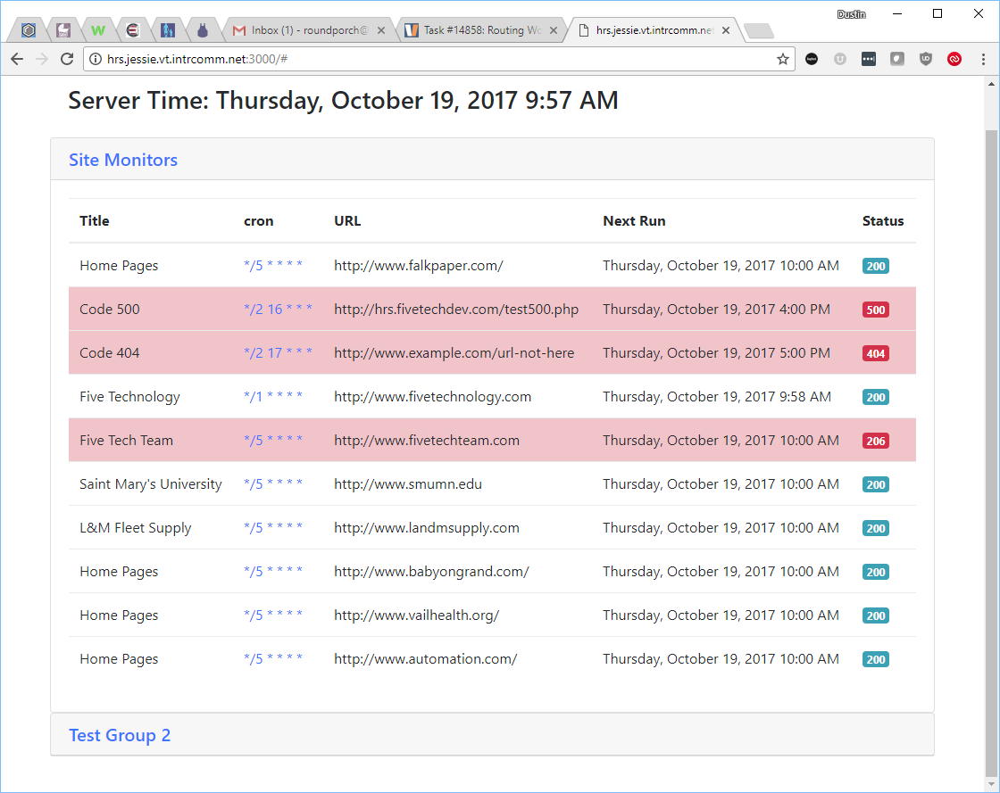

# HTTP Request Scheduler

Schedule, record, and notify of http based cron jobs.

# Requirements

1. Group jobs into meaningful groups, application or client
2. Allow running jobs on multiple domains i.e. development/production
3. Record response for all instances: status, body

# Setup

1. Clone this repository
2. npm install
3. nodejs index.js
4. Browse to http://localhost:3000 or server address

# Inspiration + Research
https://crontab.guru/ \
https://momentjs.com/docs/

https://github.com/fzaninotto/uptime \
http://www.camintejs.com/en \
https://github.com/iloire/watchmen

